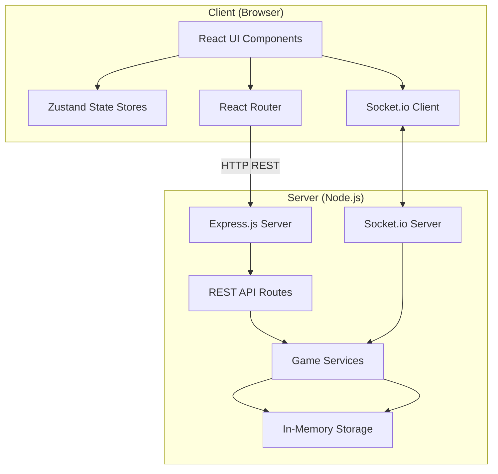
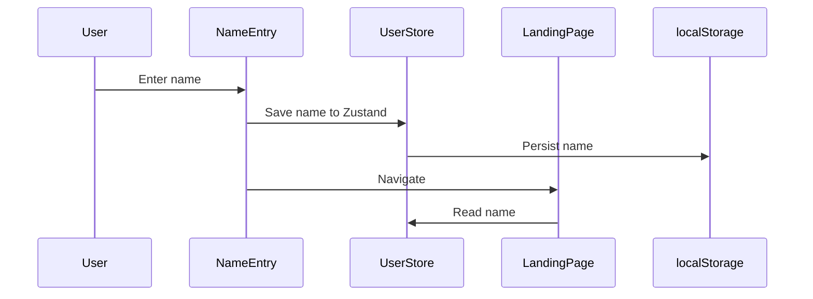
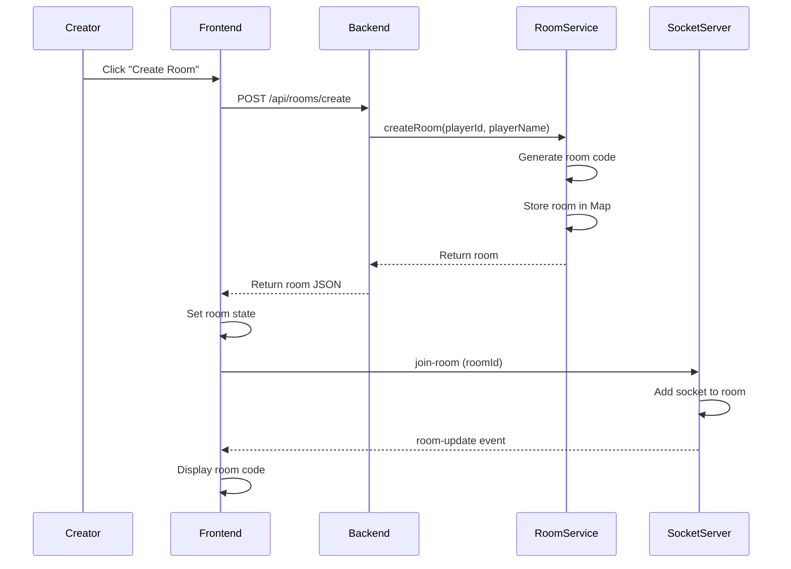
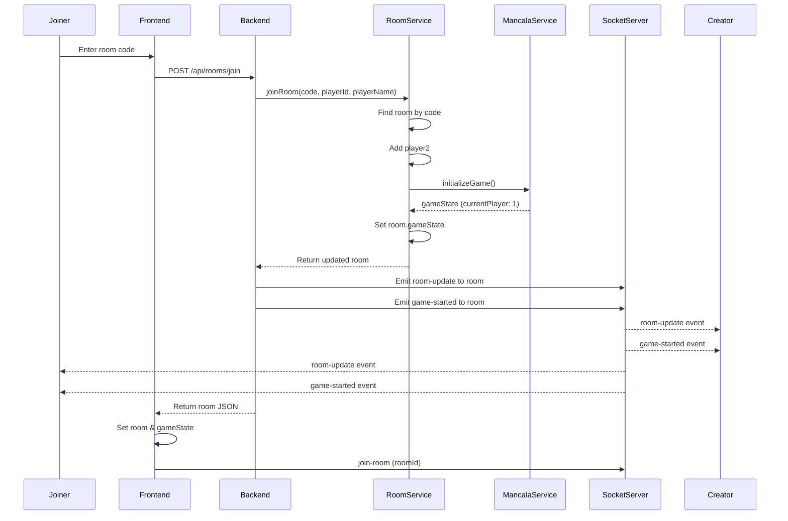
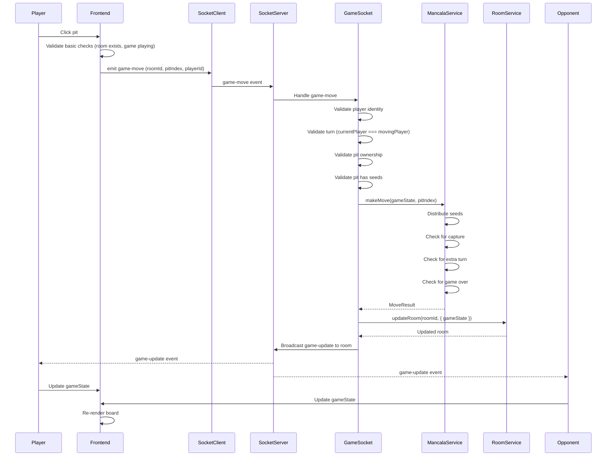
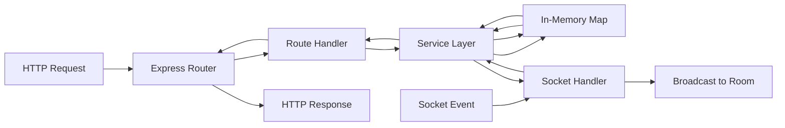
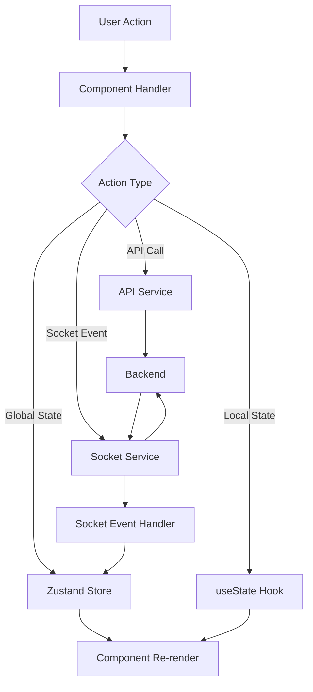
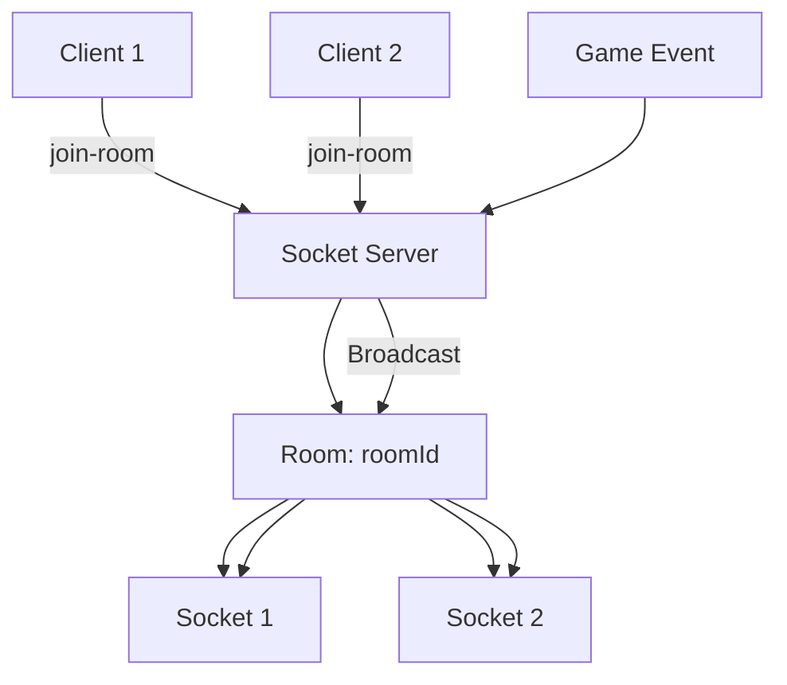
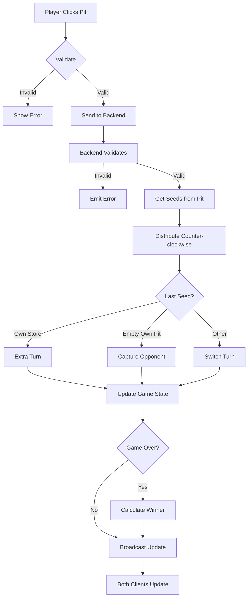
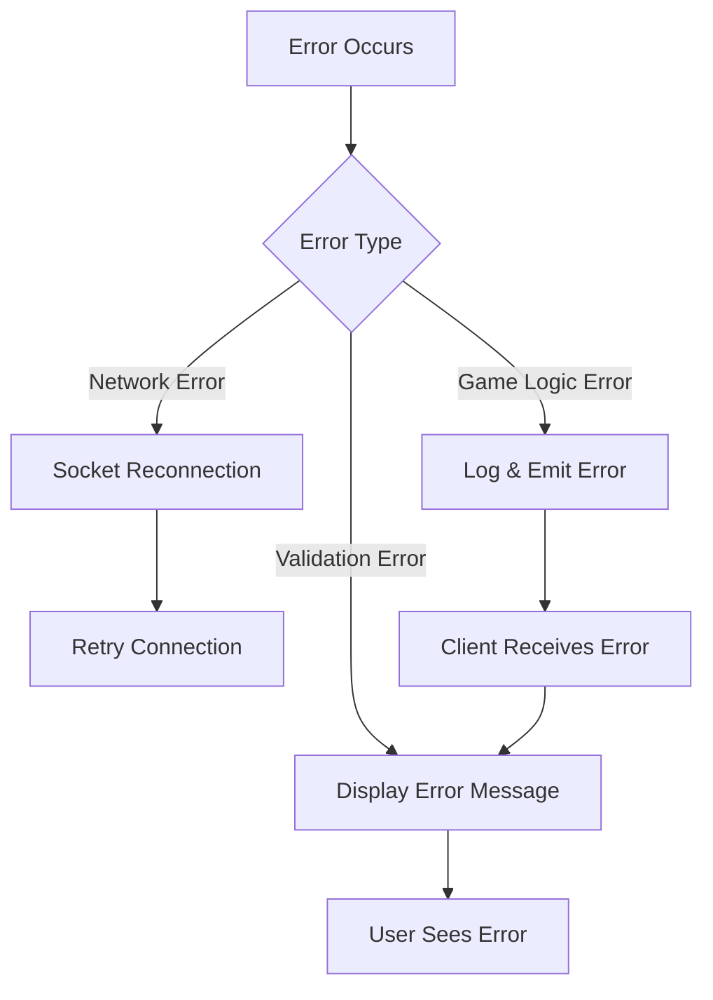

# Mancala Game - Architecture & Flow Documentation

## System Architecture

### High-Level Architecture



## Application Flow

### 1. User Entry & Authentication Flow



### 2. Room Creation Flow



### 3. Room Joining Flow



### 4. Game Move Flow



## Backend Architecture

### Service Layer Structure

```
backend/
├── src/
│   ├── server.ts           # Express + Socket.io setup
│   ├── routes/
│   │   └── rooms.ts        # REST API endpoints
│   ├── sockets/
│   │   └── gameSocket.ts   # Socket.io event handlers
│   ├── services/
│   │   ├── roomService.ts  # Room management
│   │   └── mancalaService.ts # Game logic
│   └── types/
│       └── index.ts        # TypeScript type definitions
```

### Backend Data Flow



### Room Service Responsibilities

1. **Room Creation**
   - Generate unique room code
   - Create room object
   - Store in memory map

2. **Room Joining**
   - Validate room code
   - Add player2
   - **Initialize game** (single point of initialization)
   - Return updated room

3. **Room Updates**
   - Update room properties
   - Update game state
   - Maintain last activity timestamp

4. **Room Cleanup**
   - Remove inactive rooms (>1 hour)
   - Periodic cleanup job

### Mancala Service Responsibilities

1. **Game Initialization**
   - Create initial board state
   - Set currentPlayer to 1
   - Set gameStatus to 'playing'

2. **Move Processing**
   - Validate move legality
   - Distribute seeds counter-clockwise
   - Handle captures
   - Check for extra turns
   - Detect game end
   - Calculate winner

## Frontend Architecture

### Component Structure

```
frontend/
├── src/
│   ├── pages/
│   │   ├── NameEntry.tsx
│   │   ├── LandingPage.tsx
│   │   ├── GameSelection.tsx
│   │   ├── OfflineGame.tsx
│   │   └── OnlineGame.tsx
│   ├── components/
│   │   ├── mancala/
│   │   │   ├── MancalaBoard.tsx
│   │   │   ├── Pit.tsx
│   │   │   └── Store.tsx
│   │   ├── landing/
│   │   │   ├── ProfileSection.tsx
│   │   │   ├── AudioControls.tsx
│   │   │   └── HowToPlayModal.tsx
│   │   └── common/
│   │       └── Modal.tsx
│   ├── store/
│   │   ├── userStore.ts
│   │   ├── audioStore.ts
│   │   └── mancalaStore.ts
│   ├── services/
│   │   ├── api.ts
│   │   ├── socket.ts
│   │   ├── mancalaGame.ts
│   │   ├── aiService.ts
│   │   └── audioService.ts
│   └── types/
│       └── mancala.ts
```

### Frontend State Management Flow



### State Stores

#### User Store
- User name
- Persisted to localStorage

#### Audio Store
- Volume level
- Muted state
- Persisted to localStorage

#### Mancala Store
- Game state (board, currentPlayer, gameStatus)
- Game actions (initializeGame, makeMove, resetGame)
- Persisted to localStorage (for offline games)

## Real-time Communication Architecture

### Socket.io Room Management



### Event Types

#### Client → Server Events
- `join-room` - Join a game room
- `leave-room` - Leave a game room
- `game-move` - Make a move

#### Server → Client Events
- `room-update` - Room state changed
- `game-started` - Game initialized
- `game-update` - Game state updated
- `game-over` - Game finished
- `error` - Error occurred

## Game Logic Flow

### Mancala Move Processing



### Board State Representation

```
Board Array (14 indices):
[0, 1, 2, 3, 4, 5, 6, 7, 8, 9, 10, 11, 12, 13]
 │  │  │  │  │  │  │  │  │  │  │   │   │   │
 │  │  │  │  │  │  │  │  │  │  │   │   │   └─ Player 2 Store
 │  │  │  │  │  │  │  │  │  │  │   │   └───── Player 2 Pit 5
 │  │  │  │  │  │  │  │  │  │  │   └───────── Player 2 Pit 4
 │  │  │  │  │  │  │  │  │  │  └───────────── Player 2 Pit 3
 │  │  │  │  │  │  │  │  │  └──────────────── Player 2 Pit 2
 │  │  │  │  │  │  │  │  └─────────────────── Player 2 Pit 1
 │  │  │  │  │  │  │  └─────────────────────── Player 2 Pit 0
 │  │  │  │  │  │  └────────────────────────── Player 1 Store
 │  │  │  │  │  └───────────────────────────── Player 1 Pit 5
 │  │  │  │  └──────────────────────────────── Player 1 Pit 4
 │  │  │  └────────────────────────────────── Player 1 Pit 3
 │  │  └────────────────────────────────────── Player 1 Pit 2
 │  └───────────────────────────────────────── Player 1 Pit 1
 └────────────────────────────────────────────── Player 1 Pit 0
```

## Error Handling Flow



## Security & Validation

### Backend Validation Layers

1. **Player Identity Validation**
   - Verify playerId matches room player
   - Normalize string comparison

2. **Turn Validation**
   - Check currentPlayer === movingPlayer
   - Prevent out-of-turn moves

3. **Move Validation**
   - Validate pit index range (0-13)
   - Prevent moving from stores (6, 13)
   - Validate pit ownership
   - Check pit has seeds

4. **Game State Validation**
   - Verify game is in 'playing' status
   - Check game hasn't ended

## Performance Optimizations

### Frontend
- React component memoization
- Zustand selective subscriptions
- Lazy route loading
- Optimized re-renders

### Backend
- In-memory storage (fast access)
- Event-driven architecture (non-blocking)
- Efficient room lookup (Map data structure)
- Automatic cleanup (prevent memory leaks)

## Conclusion

This architecture provides:
- **Clear Separation** - Frontend/Backend responsibilities
- **Real-time Updates** - Socket.io for multiplayer
- **Type Safety** - TypeScript throughout
- **Scalable Design** - Service layer pattern
- **Maintainable Code** - Well-organized structure
